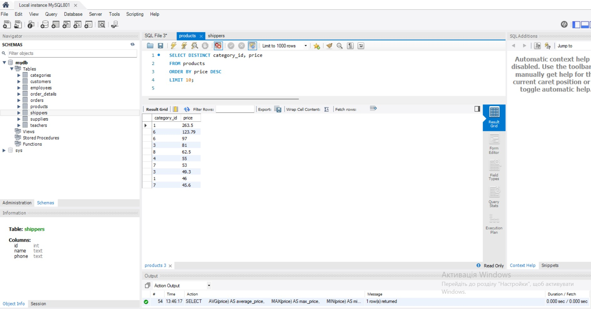

# goit-rdb-hw-03

Для виконання запитів потрібно завантажити цей архів https://drive.google.com/file/d/1B45tkzH3lIrf2CmQIB2VB0AJRB9Ly7c2/view?usp=drive_link з даними у форматі “csv”

1. Напишіть SQL команду, за допомогою якої можна:

вибрати всі стовпчики (За допомогою wildcard “\*”) з таблиці products;
вибрати тільки стовпчики name, phone з таблиці shippers,
та перевірте правильність її виконання в MySQL Workbench.

Запит:

SELECT \* FROM products;

SELECT name, phone FROM shippers;

Результат:

2. Напишіть SQL команду, за допомогою якої можна знайти середнє, максимальне та мінімальне значення стовпчика price таблички products, та перевірте правильність її виконання в MySQL Workbench*.*

Запит:

SELECT
AVG(price) AS average_price,
MAX(price) AS max_price,
MIN(price) AS min_price
FROM products;

Результат:

3. Напишіть SQL команду, за допомогою якої можна обрати унікальні значення колонок category_id та price таблиці products.

Оберіть порядок виведення на екран за спаданням значення price та виберіть тільки 10 рядків. Перевірте правильність виконання команди в MySQL Workbench.

Запит:

SELECT DISTINCT category_id, price
FROM products
ORDER BY price DESC
LIMIT 10;

Результат:

4. Напишіть SQL команду, за допомогою якої можна знайти кількість продуктів (рядків), які знаходиться в цінових межах від 20 до 100, та перевірте правильність її виконання в MySQL Workbench.

Запит:

SELECT COUNT(\*) AS product_count
FROM products
WHERE price BETWEEN 20 AND 100;

Результат:

5. Напишіть SQL команду, за допомогою якої можна знайти кількість продуктів (рядків) та середню ціну (price) у кожного постачальника (supplier_id), та перевірте правильність її виконання в MySQL Workbench.

Запит:

SELECT
supplier_id,
COUNT(\*) AS product_count,
AVG(price) AS average_price
FROM products
GROUP BY supplier_id;

Результат:

